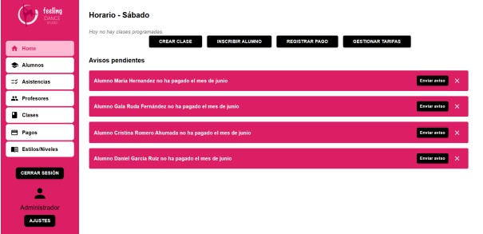

# FDS Manager

FDS Manager (Feeling Dance Studio Manager) es una aplicación multiplataforma desarrollada como Trabajo de Fin de Grado (CFGS Desarrollo de Aplicaciones Multiplataforma) por Gala Ruda Fernández. Esta herramienta está diseñada para optimizar la gestión interna de una academia de baile, centralizando procesos como el control de alumnos, profesores, clases, mensualidades y horarios.

## Objetivo del proyecto

Modernizar y automatizar la gestión administrativa de academias de baile mediante una aplicación intuitiva, segura y funcional. Incluye:

- Panel de administrador para gestión completa del centro.
- Panel de profesor con acceso a su horario diario/mensual, clases asignadas y registro de asistencia de alumnos.
- Sistema de pagos mensual a alumnos y profesores.
- Control de aforo y visualización de asistencia por clase.
- Seguridad con autenticación JWT y cifrado de contraseñas (BCrypt).

## Tecnologías utilizadas

- **Frontend:** React 19 + React Router + MUI (Material UI)
- **Backend:** Spring Boot (Java) + Spring Security (JWT)
- **Base de datos:** MySQL
- **Despliegue:** Render (frontend como sitio estático, backend en Docker) y Railway (Base de datos)
- **Servicios externos:** Google Drive API para almacenamiento de imágenes y SMTP Gmail para correos

## Arquitectura general

- Aplicación cliente-servidor desacoplada
- API RESTful para comunicación frontend-backend
- Acceso basado en roles: `ADMIN` y `TEACHER`

## Características principales

- Gestión CRUD de alumnos y profesores
- Inscripciones mensuales con distintos tipos de tarifas
- Registro y consulta de pagos
- Gestión de horarios y clases
- Asistencia diaria por alumno y clase
- Interfaz responsive adaptada a escritorio y móvil
- Seguridad con JWT + BCrypt + CORS + cifrado TLS

## Capturas de pantalla

| Login | Inicio Admin | Alumnos | Profesores |
|-------|--------------|---------|------------|
|  |  |  |  |

| Clases | Pagos | Asistencias | Estilos/Niveles |
|--------|-------|-------------|-----------------|
|  |  |  |  |

## Autora

**Gala Ruda Fernández**  
[LinkedIn](https://www.linkedin.com/in/gala-ruda-fernandez) | [GitHub](https://github.com/galarudaf) | gala.ruda.f@gmail.com

---

Este proyecto ha sido realizado como parte del TFG del CFGS DAM en el IES Julio Verne (Sevilla) en el curso 2024-2025.
